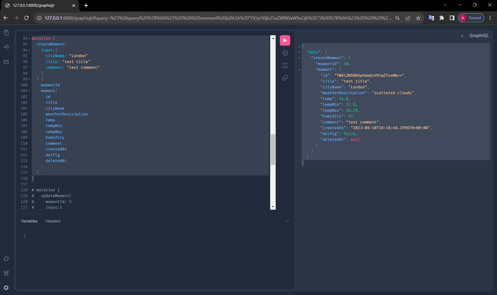
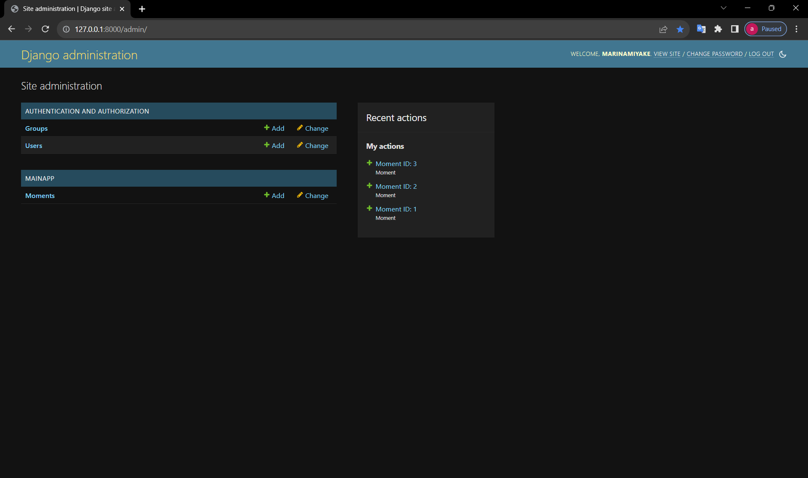
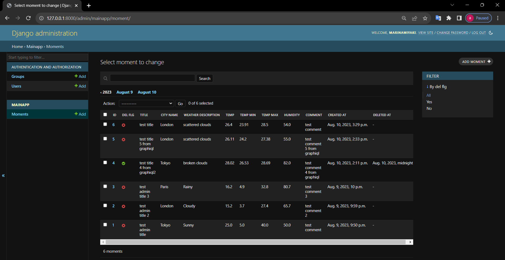
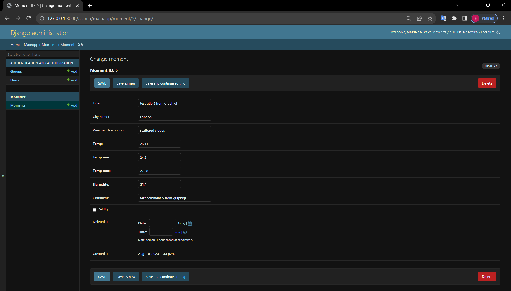

# Marina's Weather Moment Post API (Sample App for GraphQL (graphene-django))

One can save "moment" with current weather information by calling this app (API) from GraphiQL.

## License

This work is a portfolio temporarily published for my personal job search.
Only recruiters can use this work to check my codes.
NO ONE ELSE HAS THE PERMISSION TO MODIFY AND DISTRIBUTE.
THIS IS NOT AN OPEN SOURCE SOFTWARE.

## Features

This system is for those who want to take notes of current feelings or ideas with weather information.<br>
One can use:

* Create, Read & List (Filter), Update, Delete Function
* Admin Function (Customized DjangoAdmin)

## Visuals and Usage

* <b>GraphiQL Page : </b><br>
  You can call API from this page.<br>
  If you call API from the left side (Write query and run), you'll get result on the right side.<br>

  http://127.0.0.1:8000/graphiql/

  

    * [Query (get Moment list)]<br>

        * Variables <br>
          first: Pagination unit (Page limit)<br>
          after: Page (Set the "cursor" value of the previous page(request)'s last node instead of setting page
          number)<br>
          momentId: Momoent ID (ID generated by Django in your DB) filter<br>
          title: Title (contains, case insensitive) filter<br>
          comment: Comment (contains, case insensitive) filter<br>
          <br>

        * Filter by ID <br>
          Input:

          ```
          query {
            moments (momentId:3) {
              pageInfo {
                startCursor
                endCursor
                hasNextPage
                hasPreviousPage
              }
              edges {
                cursor
                node {
                  rowNum
                  momentId
                  title
                  cityName
                  weatherDescription
                  temp
                  tempMin
                  tempMax
                  humidity
                  comment
                  createdAt
                }
              }
            }
          }
          ```

          Output:

          ```
          {
            "data": {
              "moments": {
                "pageInfo": {
                  "startCursor": "YXJyYXljb25uZWN0aW9uOjA=",
                  "endCursor": "YXJyYXljb25uZWN0aW9uOjA=",
                  "hasNextPage": false,
                  "hasPreviousPage": false
                },
                "edges": [
                  {
                    "cursor": "YXJyYXljb25uZWN0aW9uOjA=",
                    "node": {
                      "rowNum": 1,
                      "momentId": 3,
                      "title": "test admin title 3",
                      "cityName": "Paris",
                      "weatherDescription": "Rainy",
                      "temp": 16.2,
                      "tempMin": 4.9,
                      "tempMax": 32.8,
                      "humidity": 80.7,
                      "comment": "test comment 3",
                      "createdAt": "2023-08-09T22:00:52.983355+00:00"
                    }
                  }
                ]
              }
            }
          }
          ```

        * Filter by title and city_name <br>

          Input:

          ```
          query {
            moments (title: "admin" cityName:"London") {
              pageInfo {
                  startCursor
                endCursor
                hasNextPage
                hasPreviousPage
              }
              edges {
                cursor
                node {
                  rowNum
                  momentId
                  title
                  cityName
                  weatherDescription
                  temp
                  tempMin
                  tempMax
                  humidity
                  comment
                  createdAt
                }
              }
            }
          }
          ```

          Output:

          ```
          {
            "data": {
              "moments": {
                "pageInfo": {
                  "startCursor": "YXJyYXljb25uZWN0aW9uOjA=",
                  "endCursor": "YXJyYXljb25uZWN0aW9uOjA=",
                  "hasNextPage": false,
                  "hasPreviousPage": false
                },
                "edges": [
                  {
                    "cursor": "YXJyYXljb25uZWN0aW9uOjA=",
                    "node": {
                      "rowNum": 1,
                      "momentId": 2,
                      "title": "test admin title 2",
                      "cityName": "London",
                      "weatherDescription": "Cloudy",
                      "temp": 15.2,
                      "tempMin": 3.7,
                      "tempMax": 27.4,
                      "humidity": 65.7,
                      "comment": "test comment 2",
                      "createdAt": "2023-08-09T21:59:44.108129+00:00"
                    }
                  }
                ]
              }
            }
          }
          ```

        * Get paginated result <br>

          Input:

          ```
          query {
            moments (first:2 after:"YXJyYXljb25uZWN0aW9uOjA=") {
              pageInfo {
                  startCursor
                endCursor
                hasNextPage
                hasPreviousPage
              }
              edges {
                cursor
                node {
                  rowNum
                  momentId
                  title
                  cityName
                  weatherDescription
                  temp
                  tempMin
                  tempMax
                  humidity
                  comment
                  createdAt
                }
              }
            }
          }
          ```

          Output:

          ```
          {
            "data": {
              "moments": {
                "pageInfo": {
                  "startCursor": "YXJyYXljb25uZWN0aW9uOjE=",
                  "endCursor": "YXJyYXljb25uZWN0aW9uOjI=",
                  "hasNextPage": true,
                  "hasPreviousPage": false
                },
                "edges": [
                  {
                    "cursor": "YXJyYXljb25uZWN0aW9uOjE=",
                    "node": {
                      "rowNum": 2,
                      "momentId": 2,
                      "title": "test admin title 2",
                      "cityName": "London",
                      "weatherDescription": "Cloudy",
                      "temp": 15.2,
                      "tempMin": 3.7,
                      "tempMax": 27.4,
                      "humidity": 65.7,
                      "comment": "test comment 2",
                      "createdAt": "2023-08-09T21:59:44.108129+00:00"
                    }
                  },
                  {
                    "cursor": "YXJyYXljb25uZWN0aW9uOjI=",
                    "node": {
                      "rowNum": 3,
                      "momentId": 3,
                      "title": "test admin title 3",
                      "cityName": "Paris",
                      "weatherDescription": "Rainy",
                      "temp": 16.2,
                      "tempMin": 4.9,
                      "tempMax": 32.8,
                      "humidity": 80.7,
                      "comment": "test comment 3",
                      "createdAt": "2023-08-09T22:00:52.983355+00:00"
                    }
                  }
                ]
              }
            }
          }
          ```

    * [Mutation (Create Moment)]<br>
      Input:

      ```
      mutation {
        createMoment(
          input:{
            cityName: "London"
            title: "test title"
            comment: "test comment"
          }
        ) {
          momentId
          moment{
            id
            title
            cityName
            weatherDescription
            temp
            tempMin
            tempMax
            humidity
            comment
            createdAt
            delFlg
            deletedAt
          }
        }
      }
      ```

      Output:

      ```
      {
        "data": {
          "createMoment": {
            "momentId": 10,
            "moment": {
              "id": "TW9tZW50RGphbmdvVHlwZToxMA==",
              "title": "test title",
              "cityName": "London",
              "weatherDescription": "scattered clouds",
              "temp": 24.8,
              "tempMin": 22.8,
              "tempMax": 26.28,
              "humidity": 57,
              "comment": "test comment",
              "createdAt": "2023-08-10T18:18:46.299870+00:00",
              "delFlg": false,
              "deletedAt": null
            }
          }
        }
      }
      ```

    * [Mutation (Update Moment)]<br>
      Input:

      ```
      mutation {
        updateMoment(
          momentId: 1
          input:{
            title: "test title 2"
            comment: "test comment 2"
          }
        ) {
          momentId
          moment{
            id
            title
            cityName
            weatherDescription
            temp
            tempMin
            tempMax
            humidity
            comment
            createdAt
            delFlg
            deletedAt
          }
        }
      }
      ```

      Output:

      ```
      {
        "data": {
          "updateMoment": {
            "momentId": 1,
            "moment": {
              "id": "TW9tZW50RGphbmdvVHlwZTox",
              "title": "test title 2",
              "cityName": "Tokyo",
              "weatherDescription": "Sunny",
              "temp": 25,
              "tempMin": 5,
              "tempMax": 40,
              "humidity": 50,
              "comment": "test comment 2",
              "createdAt": "2023-08-09T21:50:13.618289+00:00",
              "delFlg": false,
              "deletedAt": null
            }
          }
        }
      }
      ```

    * [Mutation (Delete Moment)]<br>
      Input:

      ```
      mutation {
        deleteMoment(momentId: 5) {
          momentId
          moment{
            id
            title
            cityName
            weatherDescription
            temp
            tempMin
            tempMax
            humidity
            comment
            createdAt
            delFlg
            deletedAt
          }
        }
      }
      ```

      Output:

      ```
      {
        "data": {
          "deleteMoment": {
            "momentId": 5,
            "moment": {
              "id": "TW9tZW50RGphbmdvVHlwZTo1",
              "title": "test title 2",
              "cityName": "London",
              "weatherDescription": "scattered clouds",
              "temp": 26.11,
              "tempMin": 24.2,
              "tempMax": 27.38,
              "humidity": 55,
              "comment": "test comment 2",
              "createdAt": "2023-08-10T14:33:53.301690+00:00",
              "delFlg": true,
              "deletedAt": "2023-08-10T18:21:11.898126+00:00"
            }
          }
        }
      }
      ```

* <b>DjangoAdmin Page : </b><br>
  Project is managed from this page.

  http://127.0.0.1:8000/admin/
  <br>
    * DjangoAdmin Home <br>
      
      <br>
    * DjangoAdmin Moment List <br>
      
      <br>
    * DjangoAdmin Moment Detail <br>
      
      <br>

## Requirement

See "public-py-dj-graphql > requirements.txt"

## Installation

1. Get Python3 and PyCharm<br>
   (For your information: https://www.guru99.com/how-to-install-python.html)
2. Open PyCharm and go to "VCS > Get From Version Control"<br>
   (If you already have your own project in PyCharm, go to "Git > Clone")
3. Get clone URL, enter the URL into PyCharm's modal, also select your local directory, and "Apply."
4. Copy ".env_local_sample" and create ".env" to the same directory. <br>
   Then replace the WEATHER_API_KEY with your own Weather API key. <br>
   To get your own Weather API key, sign up from here: <br>
   https://home.openweathermap.org/users/sign_up
5. Open terminal in your PyCharm.
6. Install Django and all libraries in [Requirement](#Requirement) with the following commands:

```bash
pip install Django==4.2.3
pip install django-environ==0.10.0
pip install graphene-django==3.1.3
pip install requests==2.31.0
```

7. Go to "File > Settings > Project: {your directory name} > Python Interpreter" and make sure that you see <br>
   everything you installed.
8. Run the following command:

```bash
python manage.py makemigrations
python manage.py migrate
```

9. Create an admin user with the following command:

```bash
 python manage.py createsuperuser
```

10. Run manage.py<br>
    (Move mouse cursor to manage.py in PyCharm and right click, then you'll see the "Run" button. <br>
    After you run it once, open Run Configurations window in PyCharm, add parameter "runserver 127.0.0.1:8000" <br>
    and run again.)<br>


11. Check if you can access to DjangoAdmin page (http://127.0.0.1:8000/admin/).

12. Access to GraphiQL (http://127.0.0.1:8000/graphiql/) and execute following query from the left side. <br>
    If you get created record on the right side, this section is now complete.

```
mutation {
  createMoment(
    input:{
      cityName: "London"
      title: "test title"
      comment: "test comment"
    }
  ) {
    moment{
      id
      title
      cityName
      weatherDescription
      temp
      tempMin
      tempMax
      humidity
      comment
      createdAt
      delFlg
      deletedAt
    }
  }
}
```

## Note

This portfolio demonstrates my ability to create a sample WEB application from scratch and shows that I have <br>
sufficient coding experience.<br>
There are no documents in this project which are usually required in system development method (documents of <br>
function design, unit test, coding rules, etc.) as the format and guidelines differ, depending on teams.<br>

## Author

* Marina Miyake
* marinamiyake@outlook.com